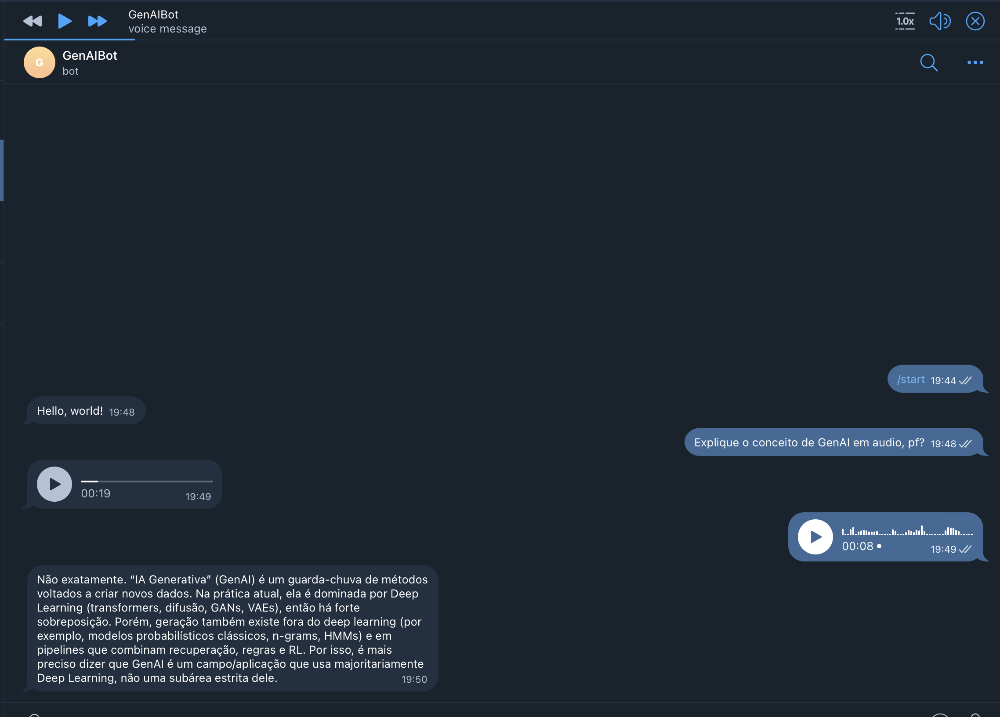

# Telegram GenAI Bot

A simple Telegram bot that uses generative AI to reply to messages.



## Features

- 🤖 AI-generated replies using the `gpt-5` model
- 💬 Simple interface via Telegram
- 🧹 Command to clear conversation history
- 📝 Built-in help commands
- 🎤 Audio support: transcribes voice messages with Whisper (`whisper-1`) and can reply with voice via TTS (`tts-1-hd`, voice `nova`)

## Setup

### Prerequisites

- Python 3.11+
- Telegram account
- OpenAI API key

### Installation

1. Clone the repository

```bash
git clone <repository-url>
cd telegram-GenAI-bot-demo
```

2. Install dependencies

- Option A: Conda (recommended)

```bash
conda env create -f environment.yaml
conda activate telegram-genai-bot
```

- Option B: pip + venv

```bash
python3 -m venv .venv
source .venv/bin/activate
pip install -U aiogram openai python-dotenv pygame
```

3. Create an `.env` file in the project root with your credentials

```
TELEGRAM_BOT_TOKEN=your_bot_token
OPENAI_API_KEY=your_openai_key
```

### How to get credentials

1. **Telegram Bot Token**

   - Talk to @BotFather on Telegram
   - Use the `/newbot` command
   - Follow the instructions to create your bot

2. **OpenAI API Key**
   - Visit [OpenAI Platform](https://platform.openai.com/)
   - Create an account and generate an API key

## Usage

Run the bot:

```bash
python main.py
```

### Available commands

- `/start` — Welcome message
- `/help` — Shows help and available commands
- `/clear_history` — Clears the conversation history

Tip: Send a voice message to get it transcribed. Ask for “voice” if you want the bot to reply with audio.

## Project Structure

```
telegram-GenAI-bot-demo/
├── main.py               # Bot entrypoint
├── generative_service.py # Generative AI service (Chat, TTS, Whisper)
├── message_history.py    # Conversation history management
├── environment.yaml      # Project dependencies
└── README.md             # This file
```

## Technologies Used

- **aiogram** — Framework for Telegram bots
- **OpenAI** — Chat Completions, Whisper (STT), and TTS
- **python-dotenv** — Environment variable management

## License

This project is open source and available under the MIT license.
